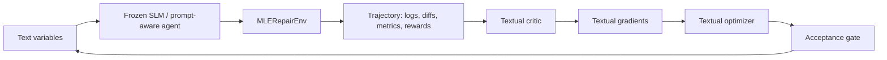

# TextGrad-RL MLE

TextGrad-RL MLE is a local Python research prototype for trajectory-level textual gradients in ML-engineering repair tasks. It demonstrates a frozen agent improving its behavior by updating only modular prompt text variables from full environment trajectories.



## What TextGrad-RL Means

The loop treats prompt modules as optimizable text variables. A frozen actor runs inside an RL-style environment, producing actions, logs, diffs, rewards, metrics, and failures. A textual critic reads the whole trajectory and emits module-level textual gradients. A textual optimizer edits prompt text, and an acceptance gate keeps updates only when validation tasks do not regress.

This is not PPO, RLHF, or model fine-tuning. No model weights are trained. The default demo is completely offline: the actor is a prompt-aware heuristic policy and the critic is heuristic. Optional local small-language-model adapters can call an OpenAI-compatible endpoint, but they are not required.

## Why Frozen SLM Agents

Small local agents are attractive on Apple silicon because they can run without cloud APIs or CUDA. This repo isolates a practical question: can trajectory feedback improve an agent's ML-engineering behavior when the only trainable objects are textual instructions?

## Why ML-Engineering Environments

The environment resembles a compact engineer loop: read files, inspect logs, edit code, run tests, run training, run evaluation, and submit a patch. It exposes realistic failure modes while staying fast enough for local CPU experiments.

## Mac Pro / Apple Silicon Setup

Use Python 3.11 or 3.12 on macOS. The required path uses CPU-only Python packages: numpy, pandas, scikit-learn, and pytest. There are no CUDA, Linux `/proc`, GPU Docker, cloud API, or API-key requirements.

## Installation

```bash
python3 -m venv .venv
.venv/bin/python -m pip install -e ".[dev]"
```

## Running Tests

```bash
pytest -q
```

Or, when using the default virtual environment:

```bash
.venv/bin/python -m pytest -q
```

## Running The Offline Demo

```bash
.venv/bin/python -m textgrad_rl.run_experiment --config configs/mac_demo.json
```

Artifacts are written under `runs/mac_demo`.

## Running The Full Local Experiment

```bash
.venv/bin/python -m textgrad_rl.run_experiment --config configs/mac_full.json
```

## Optional Local SLM Actor

The local LLM path is optional and assumes you already run an OpenAI-compatible local server, such as Ollama, llama.cpp server, MLX-based servers, or another compatible runtime.

```bash
export TEXTGRAD_RL_LLM_BASE_URL="${TEXTGRAD_RL_LLM_BASE_URL:-http://localhost:11434/v1}"
export TEXTGRAD_RL_LLM_MODEL="${TEXTGRAD_RL_LLM_MODEL:-qwen2.5-coder:3b}"
bash scripts/run_local_slm_actor.sh
```

The script does not assume the model exists; configure it for your local server.

## Running A Local TextArena Benchmark

TextArena is optional because it adds external benchmark dependencies. Install it with:

```bash
.venv/bin/python -m pip install -e ".[textarena]"
```

Then run the offline TicTacToe full round-robin benchmark:

```bash
.venv/bin/python -m textgrad_rl.benchmarks.textarena_benchmark \
  --env-id TicTacToe-v0 \
  --episodes-per-matchup 20 \
  --output-dir runs/textarena_tictactoe_full
```

This uses the installed TextArena package locally and does not call the TextArena online evaluation service.

To compare fixed text variables against TextGrad-style learned text rules across ten offline TextArena environments:

```bash
.venv/bin/python -m textgrad_rl.benchmarks.textarena_multienv_compare \
  --train-seeds 5 \
  --test-seeds 10 \
  --output-dir runs/textarena_10env_textgrad_vs_no_textgrad
```

For a paper-style TextArena suite with fixed, scalar-only, monolithic TextGrad, modular TextGrad, and no-gate baselines, validation gating, repetitions, bootstrap confidence intervals, and qualitative gradient examples:

```bash
.venv/bin/python -m textgrad_rl.benchmarks.textarena_paper_suite \
  --repetitions 3 \
  --train-seeds 5 \
  --val-seeds 5 \
  --test-seeds 10 \
  --output-dir runs/textarena_paper_suite
```

To run a real frozen local SLM on TextArena GuessTheNumber through an OpenAI-compatible server:

```bash
.venv/bin/python -m textgrad_rl.benchmarks.textarena_slm_compare \
  --model qwen2.5:3b \
  --train-seeds 3 \
  --val-seeds 3 \
  --test-seeds 5 \
  --seed 9300 \
  --output-dir runs/textarena_slm_qwen25_3b_guess_number
```

To run the same OpenAI-compatible TextArena SLM path through the OpenAI API, set an API key and point the client at OpenAI:

```bash
export OPENAI_API_KEY="..."
export TEXTGRAD_RL_LLM_BASE_URL="https://api.openai.com/v1"

.venv/bin/python -m textgrad_rl.benchmarks.textarena_expanded_suites \
  --suites puzzle,social,real_slm \
  --slm-train-seeds 1 \
  --slm-val-seeds 1 \
  --slm-test-seeds 1 \
  --output-dir runs/textarena_expanded_suites_openai_chat_latest \
  --model chat-latest
```

Use `chat-latest` to track the latest Instant model used in ChatGPT, or `gpt-5.5` for the current recommended production API model. You can also set `TEXTGRAD_RL_LLM_API_KEY` instead of `OPENAI_API_KEY` if you want a repo-specific credential.

To run the improved TextGrad-RL+ suite with multi-candidate updates, causal credit assignment, train-replay validation, bootstrap-gated acceptance, and a learned rule library:

```bash
.venv/bin/python -m textgrad_rl.benchmarks.textarena_textgrad_plus \
  --repetitions 3 \
  --train-seeds 5 \
  --val-seeds 5 \
  --test-seeds 10 \
  --output-dir runs/textarena_textgrad_plus
```

To run the more explicitly RL-shaped TextGrad policy-iteration suite with action-level credit assignment, advantage-weighted textual gradients, candidate policy search, replay buffers, and a tabular value critic:

```bash
.venv/bin/python -m textgrad_rl.benchmarks.textarena_policy_iteration \
  --repetitions 3 \
  --train-seeds 5 \
  --val-seeds 5 \
  --test-seeds 10 \
  --output-dir runs/textarena_policy_iteration
```

This suite also includes `textgrad_ppo`, a PPO-style trust-region method over TextGrad text-policy updates. It uses paired old/new rollouts, a clipped behavioral-ratio surrogate, and a KL-style trust-region gate:

```bash
.venv/bin/python -m textgrad_rl.benchmarks.textarena_policy_iteration \
  --repetitions 3 \
  --train-seeds 5 \
  --val-seeds 5 \
  --test-seeds 10 \
  --output-dir runs/textarena_policy_iteration_with_ppo
```

To run the expanded TextArena benchmark set covering difficulty generalization, puzzle SLM games, social SLM games, and a real frozen-SLM TextArena suite:

```bash
.venv/bin/python -m textgrad_rl.benchmarks.textarena_expanded_suites \
  --suites difficulty,puzzle,social,real_slm \
  --repetitions 2 \
  --train-seeds 3 \
  --val-seeds 3 \
  --test-seeds 3 \
  --slm-train-seeds 1 \
  --slm-val-seeds 1 \
  --slm-test-seeds 1 \
  --output-dir runs/textarena_expanded_suites \
  --model qwen2.5:3b
```

To stress the SLM prompt-update methods with stochastic decoding and compare PPO-style SLM gating:

```bash
.venv/bin/python -m textgrad_rl.benchmarks.textarena_expanded_suites \
  --suites puzzle,social,real_slm \
  --slm-methods fixed_prompt_slm,textgrad_policy_iteration_slm,textgrad_ppo_slm \
  --slm-train-seeds 1 \
  --slm-val-seeds 1 \
  --slm-test-seeds 1 \
  --output-dir runs/textarena_ppo_slm_qwen25_3b_t07 \
  --model qwen2.5:3b \
  --temperature 0.7
```

## Task Suite

The generated CPU-light task families are:

- `shape_mismatch_training_crash`: wrong feature dimension in training.
- `missing_column_preprocessing`: stale schema assumption such as `age_years` vs `age`.
- `reproducibility_failure`: missing deterministic `random_state`.
- `metric_regression`: wrong label mapping or metric path regression.
- `inference_latency_regression`: repeated loading or non-vectorized inference.

Each task has visible tests and hidden validation. The environment rejects unsafe actions such as editing tests, hidden validation, reward/metadata files, thresholds, outside paths, network shortcuts, and non-allow-listed commands.

## Methods And Baselines

- `fixed_prompt`: evaluate initial prompts without updates.
- `scalar_prompt_search`: mutate prompts from scalar outcomes only.
- `modular_textgrad`: default method with targeted textual gradients.
- `monolithic_textgrad`: concatenate all prompts and optimize one text variable.
- `no_acceptance_gate`: apply textual updates without validation gating.

## Artifact Layout

Runs write `config.json`, `initial_text_variables.json`, `final_text_variables.json`, `metrics.csv`, `summary.md`, task specs, environment info, trajectory JSON, trajectory text reports, gradients, and accepted/rejected update logs under `runs/<run_name>/`.

## Limitations

The offline agent and critic are heuristic research scaffolds, not real SLMs. The tasks are synthetic and intentionally small. The local LLM adapter is optional and depends on user-managed local infrastructure.

## Future Work

Useful next experiments include running `configs/mac_full.json`, comparing all ablations with the same seed, adding a real local SLM actor, adding MLX-native model runners, and expanding the task suite with harder multi-file repairs.
